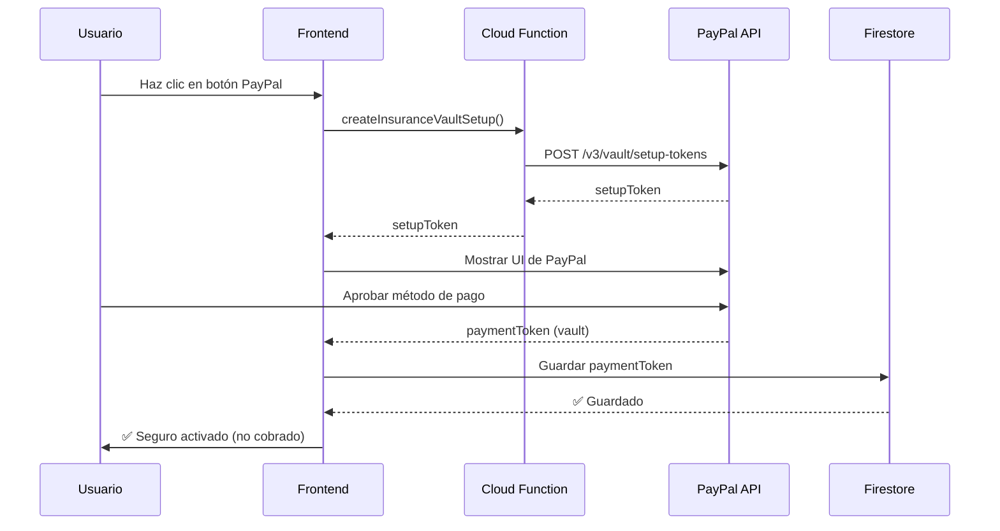
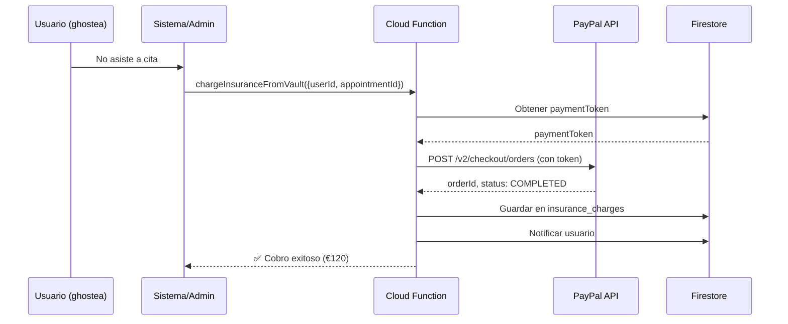
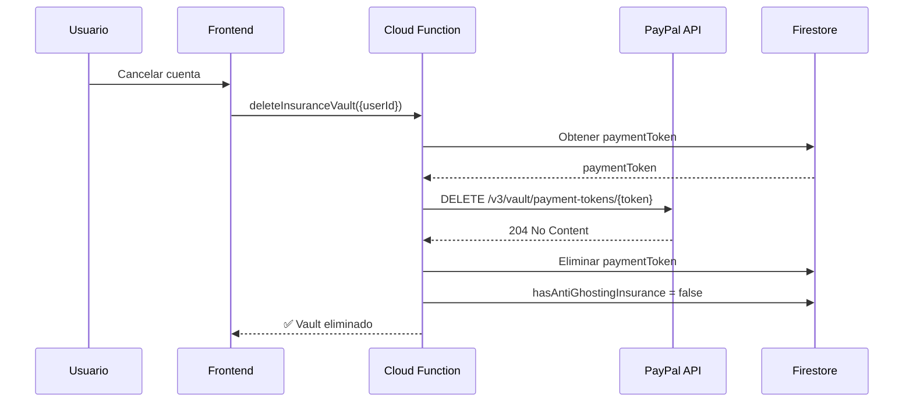

# PayPal Vault Insurance System - TuCitaSegura

> **Última actualización:** 2025-11-15
> **Estado:** ✅ Implementado y listo para deploy
> **Problema resuelto:** Retenciones de PayPal limitadas a 29 días

---

## 📋 Tabla de Contenidos

1. [Resumen Ejecutivo](#resumen-ejecutivo)
2. [El Problema Original](#el-problema-original)
3. [La Solución: PayPal Vault](#la-solución-paypal-vault)
4. [Arquitectura del Sistema](#arquitectura-del-sistema)
5. [Flujo Completo](#flujo-completo)
6. [Implementación Técnica](#implementación-técnica)
7. [Configuración](#configuración)
8. [Testing](#testing)
9. [Deployment](#deployment)
10. [FAQ Técnico](#faq-técnico)

---

## Resumen Ejecutivo

### ¿Qué es esto?

Sistema de **seguro anti-plantón** que guarda el método de pago del usuario indefinidamente y solo cobra €120 cuando el usuario no asiste a una cita confirmada.

### ¿Cómo funciona?

1. Usuario "compra" seguro → **NO se cobra nada**
2. PayPal guarda su método de pago (tarjeta)
3. Usuario agenda citas libremente
4. Si planta a alguien → **Se cobra €120 automáticamente**
5. Si asiste siempre → **Nunca se cobra nada**

### Ventajas vs. Sistema Anterior

| Característica | Autorizaciones (anterior) | Vault (actual) |
|----------------|--------------------------|----------------|
| Duración | 29 días máximo | Indefinida ⭐ |
| Cobro inicial | €0 | €0 |
| Métodos de pago | Solo tarjetas | Tarjetas ⭐ |
| Complejidad | Media | Baja ⭐ |
| Renovaciones | Sí (cada 29 días) | No ⭐ |
| UX | Confusa | Clara ⭐ |

---

## El Problema Original

### Sistema de Autorizaciones PayPal

El sistema original usaba **PayPal Authorizations** (`intent=authorize`):

```javascript
// ❌ SISTEMA ANTERIOR (NO USAR)
paypal.Buttons({
  createOrder: function(data, actions) {
    return actions.order.create({
      intent: 'AUTHORIZE', // Solo autorizar, no capturar
      purchase_units: [{
        amount: { value: '120.00' }
      }]
    });
  }
});
```

**Problemas:**

1. ⏰ **Expiración en 29 días**: Las autorizaciones de PayPal expiran automáticamente después de 29 días
2. 🔄 **Renovación manual**: Requiere que el usuario vuelva a autorizar cada mes
3. 😵 **UX confusa**: El usuario no entiende por qué debe "pagar" cada mes si no ha plantado a nadie
4. 💳 **Solo saldo PayPal**: No funciona con saldo de PayPal, solo con tarjetas vinculadas
5. 🐛 **Complejidad**: Requiere lógica de renovación automática

---

## La Solución: PayPal Vault

### ¿Qué es PayPal Vault?

**PayPal Vault** es un sistema que permite:

- Guardar métodos de pago (tarjetas o cuenta PayPal) **indefinidamente**
- Cobrar cuando sea necesario **sin presencia del usuario**
- **No expira** hasta que el usuario lo revoque
- Más simple y transparente para el usuario

### Documentación Oficial

- [Save Payment Methods - PayPal Docs](https://developer.paypal.com/docs/checkout/save-payment-methods/)
- [Vault API Reference](https://developer.paypal.com/docs/api/vault/v3/)
- [JavaScript SDK Vault](https://developer.paypal.com/docs/checkout/save-payment-methods/purchase-later/js-sdk/paypal/)

---

## Arquitectura del Sistema

### Componentes

```
┌─────────────────────────────────────────────────────────────┐
│                    Frontend (seguro.html)                    │
│  • PayPal SDK con vault=true&intent=tokenize                │
│  • Llama a createInsuranceVaultSetup Cloud Function         │
│  • Recibe payment token y lo guarda en Firestore            │
└─────────────────────┬───────────────────────────────────────┘
                      │
                      ▼
┌─────────────────────────────────────────────────────────────┐
│              Cloud Functions (functions/index.js)            │
│  1. createInsuranceVaultSetup (callable)                    │
│     → Crea vault setup token con PayPal API                 │
│                                                              │
│  2. chargeInsuranceFromVault (callable, admin-only)         │
│     → Cobra €120 cuando hay plantón                          │
│                                                              │
│  3. deleteInsuranceVault (callable)                         │
│     → Elimina payment token cuando usuario cancela          │
└─────────────────────┬───────────────────────────────────────┘
                      │
                      ▼
┌─────────────────────────────────────────────────────────────┐
│                   PayPal Vault API                          │
│  • Guarda métodos de pago encriptados                       │
│  • Genera payment tokens (no expiran)                       │
│  • Permite cobros futuros con token                         │
└─────────────────────┬───────────────────────────────────────┘
                      │
                      ▼
┌─────────────────────────────────────────────────────────────┐
│                      Firestore                              │
│  users/{userId}:                                            │
│    • hasAntiGhostingInsurance: true                         │
│    • insurancePaymentToken: "xxx" (PayPal token)            │
│    • insurancePurchaseDate: Timestamp                       │
│    • insuranceType: "vault"                                 │
│                                                              │
│  insurance_charges/{chargeId}:                              │
│    • userId, appointmentId, orderId                         │
│    • amount: 120, currency: "EUR"                           │
│    • chargedAt: Timestamp                                   │
└─────────────────────────────────────────────────────────────┘
```

---

## Flujo Completo

### 1. Usuario Activa Seguro



**Código Frontend:**

```javascript
// webapp/seguro.html
paypal.Buttons({
  createVaultSetupToken: async function(data, actions) {
    const createVaultSetup = httpsCallable(functions, 'createInsuranceVaultSetup');
    const result = await createVaultSetup();
    return result.data.setupToken;
  },

  onApprove: async function(data, actions) {
    const paymentToken = data.vaultSetupToken;

    await updateDoc(userRef, {
      hasAntiGhostingInsurance: true,
      insurancePaymentToken: paymentToken,
      insurancePurchaseDate: serverTimestamp(),
      insuranceType: 'vault'
    });
  }
}).render('#paypal-button-container');
```

---

### 2. Usuario Planta a Alguien



**Código Cloud Function:**

```javascript
// functions/index.js
exports.chargeInsuranceFromVault = functions.https.onCall(async (data, context) => {
  // 1. Verificar que es admin
  if (context.auth.token.role !== 'admin') {
    throw new functions.https.HttpsError('permission-denied', 'Admin only');
  }

  const { userId, appointmentId, reason } = data;

  // 2. Obtener payment token del usuario
  const userDoc = await db.collection('users').doc(userId).get();
  const paymentToken = userDoc.data().insurancePaymentToken;

  // 3. Crear order con PayPal usando el token
  const orderPayload = {
    intent: 'CAPTURE',
    purchase_units: [{
      amount: { currency_code: 'EUR', value: '120.00' },
      description: `Plantón en cita ${appointmentId}`
    }],
    payment_source: {
      token: {
        id: paymentToken,
        type: 'PAYMENT_METHOD_TOKEN'
      }
    }
  };

  const orderResponse = await fetch('https://api-m.sandbox.paypal.com/v2/checkout/orders', {
    method: 'POST',
    headers: {
      'Authorization': `Bearer ${accessToken}`,
      'Content-Type': 'application/json'
    },
    body: JSON.stringify(orderPayload)
  });

  const orderData = await orderResponse.json();

  // 4. Guardar registro del cargo
  await db.collection('insurance_charges').add({
    userId,
    appointmentId,
    orderId: orderData.id,
    amount: 120,
    chargedAt: admin.firestore.FieldValue.serverTimestamp()
  });

  return { success: true, orderId: orderData.id };
});
```

---

### 3. Usuario Cancela Cuenta



---

## Implementación Técnica

### Archivos Modificados

#### 1. Cloud Functions (`functions/index.js`)

**Nuevas funciones añadidas (líneas 946-1356):**

```javascript
// 1. Crear vault setup token
exports.createInsuranceVaultSetup = functions.https.onCall(async (data, context) => {
  // Autentica con PayPal
  // Crea setup token con POST /v3/vault/setup-tokens
  // Retorna setupToken al frontend
});

// 2. Cobrar seguro cuando hay plantón
exports.chargeInsuranceFromVault = functions.https.onCall(async (data, context) => {
  // Solo admin puede llamar
  // Obtiene paymentToken de Firestore
  // Crea order con POST /v2/checkout/orders
  // Guarda registro en insurance_charges
  // Notifica al usuario
});

// 3. Eliminar vault cuando usuario cancela
exports.deleteInsuranceVault = functions.https.onCall(async (data, context) => {
  // Usuario puede eliminar su propio vault
  // Elimina token con DELETE /v3/vault/payment-tokens/{token}
  // Actualiza Firestore
});
```

#### 2. Frontend (`webapp/seguro.html`)

**Cambios principales:**

1. **PayPal SDK con Vault:**
```html
<!-- Línea 15 -->
<script src="https://www.paypal.com/sdk/js?client-id=YOUR_PAYPAL_CLIENT_ID&currency=EUR&vault=true&intent=tokenize"></script>
```

2. **Nuevo flujo de PayPal Buttons:**
```javascript
// Líneas 311-397
paypal.Buttons({
  createVaultSetupToken: async function(data, actions) {
    // Llama a Cloud Function
    const createVaultSetup = httpsCallable(functions, 'createInsuranceVaultSetup');
    return (await createVaultSetup()).data.setupToken;
  },

  onApprove: async function(data, actions) {
    // Guarda payment token en Firestore
    const paymentToken = data.vaultSetupToken;
    await updateDoc(userRef, {
      hasAntiGhostingInsurance: true,
      insurancePaymentToken: paymentToken,
      insuranceType: 'vault'
    });
  }
});
```

3. **Textos actualizados:**
   - "AUTORIZACIÓN - NO PAGO INMEDIATO" (línea 121)
   - Explicación clara de que NO se cobra al activar (líneas 199-226)
   - FAQ actualizado con 7 preguntas sobre vault (líneas 257-291)

---

## Configuración

### 1. Configurar Credenciales de PayPal

```bash
# En Firebase CLI
firebase functions:config:set paypal.client_id="YOUR_PAYPAL_CLIENT_ID"
firebase functions:config:set paypal.secret="YOUR_PAYPAL_SECRET"
firebase functions:config:set paypal.mode="sandbox"  # o "live" para producción

# Verificar
firebase functions:config:get
```

**Obtener credenciales:**

1. Ir a [PayPal Developer Dashboard](https://developer.paypal.com/dashboard/)
2. Apps & Credentials → Create App
3. Copiar **Client ID** y **Secret**
4. En sandbox: Usar credenciales de sandbox
5. En producción: Cambiar a live y obtener nuevas credenciales

### 2. Habilitar Vault en PayPal App

1. Ir a tu app en PayPal Dashboard
2. App Settings → App Feature Options
3. ✅ Marcar **"Vault"**
4. Save

### 3. Actualizar Client ID en Frontend

```html
<!-- webapp/seguro.html, línea 15 -->
<script src="https://www.paypal.com/sdk/js?client-id=TU_CLIENT_ID_AQUI&currency=EUR&vault=true&intent=tokenize"></script>
```

### 4. Actualizar firebase-config.js

Asegúrate de que exports incluya `functions`:

```javascript
// webapp/js/firebase-config.js
import { getFunctions } from "https://www.gstatic.com/firebasejs/10.12.2/firebase-functions.js";

const functions = getFunctions(app);

export { auth, db, storage, functions };
```

---

## Testing

### Testing en Sandbox

#### 1. Crear Test Account

1. Ir a [PayPal Sandbox Accounts](https://developer.paypal.com/dashboard/accounts)
2. Create Account → Personal (Buyer)
3. Nota las credenciales (email + password)

#### 2. Probar Flujo Completo

**A. Activar Seguro:**

```bash
# 1. Abrir webapp/seguro.html en navegador
# 2. Login con usuario de Firebase
# 3. Click en botón de PayPal
# 4. Login con sandbox account
# 5. Aprobar método de pago

# Verificar en Firestore:
{
  hasAntiGhostingInsurance: true,
  insurancePaymentToken: "9AB1234567890",
  insuranceType: "vault"
}
```

**B. Simular Plantón (Admin):**

```javascript
// En consola de navegador (como admin)
import { getFunctions, httpsCallable } from 'firebase/functions';

const functions = getFunctions();
const chargeInsurance = httpsCallable(functions, 'chargeInsuranceFromVault');

// Cobrar a usuario que plantó
const result = await chargeInsurance({
  userId: 'USER_ID_QUE_PLANTO',
  appointmentId: 'APPOINTMENT_ID',
  reason: 'No-show verificado'
});

console.log(result.data);
// { success: true, orderId: "ORDER_ID", amount: 120 }
```

**C. Verificar Cargo:**

1. Ir a [PayPal Sandbox](https://www.sandbox.paypal.com/)
2. Login con sandbox buyer account
3. Activity → Ver transacción de €120

**D. Eliminar Vault:**

```javascript
const deleteVault = httpsCallable(functions, 'deleteInsuranceVault');
await deleteVault({ userId: auth.currentUser.uid });
```

### Testing de Errores

**1. Payment Token Inválido:**
```javascript
// Modificar Firestore manualmente con token falso
await updateDoc(userRef, { insurancePaymentToken: 'INVALID_TOKEN' });

// Intentar cobrar
const result = await chargeInsurance({ userId, appointmentId });
// Debe fallar con error
```

**2. Usuario sin Payment Token:**
```javascript
await updateDoc(userRef, { insurancePaymentToken: null });
const result = await chargeInsurance({ userId, appointmentId });
// Error: 'User does not have saved payment method'
```

**3. No-Admin Intenta Cobrar:**
```javascript
// Como usuario regular (no admin)
const result = await chargeInsurance({ userId, appointmentId });
// Error: 'permission-denied'
```

---

## Deployment

### Deploy Completo

```bash
# 1. Asegurarse de estar en la rama correcta
git checkout claude/paypal-insurance-retention-01KCDWh2xVbLZSmqH8kX3uhW

# 2. Configurar PayPal credentials (si no lo has hecho)
firebase functions:config:set paypal.client_id="YOUR_CLIENT_ID"
firebase functions:config:set paypal.secret="YOUR_SECRET"
firebase functions:config:set paypal.mode="sandbox"

# 3. Deploy Cloud Functions
cd functions
npm install
cd ..
firebase deploy --only functions

# Esperar a que termine...
# ✔  Deploy complete!
# Functions:
#   createInsuranceVaultSetup (us-central1)
#   chargeInsuranceFromVault (us-central1)
#   deleteInsuranceVault (us-central1)

# 4. Deploy Frontend (Hosting)
firebase deploy --only hosting

# 5. Verificar
# Ir a https://TU_PROYECTO.web.app/webapp/seguro.html
```

### Rollback (si algo sale mal)

```bash
# Ver versiones anteriores
firebase functions:list

# Rollback a versión anterior
firebase rollback functions:createInsuranceVaultSetup --version VERSION_NUMBER
```

---

## FAQ Técnico

### ¿Por qué Vault en vez de Autorizaciones?

**Autorizaciones:**
- ✅ Más "tradicional" para pre-autorizaciones
- ❌ Expiran en 29 días
- ❌ Requieren renovación manual
- ❌ Solo tarjetas (no saldo PayPal en algunos casos)

**Vault:**
- ✅ NO expira
- ✅ Más simple de implementar
- ✅ Mejor UX (usuario entiende que es "guardar método de pago")
- ✅ Funciona con tarjetas vinculadas

### ¿El payment token es seguro?

**SÍ.** PayPal Vault usa tokenización:

1. PayPal guarda la tarjeta encriptada en sus servidores
2. Nosotros solo recibimos un **token** (ej: `9AB1234567890`)
3. El token **no contiene** datos de la tarjeta
4. Solo PayPal puede usar el token para cobrar
5. Si alguien roba el token, no puede usarlo fuera de PayPal API

### ¿Cuándo expira el payment token?

**Nunca**, hasta que:

1. Usuario lo revoque desde PayPal.com
2. Usuario cierre su cuenta de PayPal
3. Nosotros llamemos a `DELETE /v3/vault/payment-tokens/{token}`
4. La tarjeta expire (PayPal puede actualizar automáticamente)

### ¿Qué pasa si la tarjeta expira?

PayPal tiene un sistema llamado **"Account Updater"** que:

1. Detecta cuando una tarjeta está por expirar
2. Contacta al banco para obtener nueva información
3. Actualiza el payment token automáticamente
4. Nosotros no tenemos que hacer nada

### ¿Puedo cobrar más de €120?

**NO con el mismo token**. El payment token NO tiene cantidad fija, pero:

1. Debes ser transparente con el usuario sobre cuánto puedes cobrar
2. En nuestro caso, comunicamos claramente €120
3. Si cobras más, PayPal puede marcar tu cuenta por fraude
4. Mejor práctica: Crear nuevo vault setup para cantidades diferentes

### ¿Puedo cobrar varias veces?

**SÍ**, el payment token es reutilizable:

```javascript
// Primera vez: Usuario planta cita 1
await chargeInsuranceFromVault({ userId, appointmentId: 'cita-1' });
// Cobro: €120

// Usuario compra seguro nuevamente (nuevo token)
// ...

// Segunda vez: Usuario planta cita 2
await chargeInsuranceFromVault({ userId, appointmentId: 'cita-2' });
// Cobro: €120
```

**PERO** en nuestro modelo de negocio:

- El seguro es **de por vida**
- Si el usuario planta, **se cobra €120 y pierde el seguro**
- Debe **volver a comprar** el seguro (nuevo payment token)

### ¿Qué pasa si el cargo falla?

Posibles causas:

1. **Fondos insuficientes**: Tarjeta sin saldo
2. **Tarjeta expirada/bloqueada**
3. **Payment token revocado por usuario**
4. **Límites de gasto de la tarjeta**

Manejo:

```javascript
// En Cloud Function
const orderResponse = await fetch(ordersUrl, { ... });

if (!orderResponse.ok) {
  // Log del error
  const errorText = await orderResponse.text();
  console.error('Charge failed:', errorText);

  // Notificar admin
  await createAdminNotification({
    title: 'Cargo de seguro falló',
    message: `Usuario ${userId} - Cita ${appointmentId}`,
    error: errorText
  });

  // Marcar como "pago fallido" pero mantener registro
  await db.collection('insurance_charges').add({
    userId,
    appointmentId,
    status: 'failed',
    error: errorText
  });

  throw new functions.https.HttpsError('internal', 'Payment failed');
}
```

### ¿Cómo probar sin cobrar dinero real?

**Usar PayPal Sandbox:**

1. Modo sandbox en config: `paypal.mode="sandbox"`
2. Client ID y Secret de sandbox
3. Crear cuentas de prueba en PayPal Developer
4. Usar credenciales de prueba en frontend

Sandbox **simula** cobros pero no mueve dinero real.

### ¿Puedo usar Stripe en vez de PayPal?

**Sí**, Stripe tiene un sistema similar llamado **"Setup Intents"**:

```javascript
// Stripe equivalent
const setupIntent = await stripe.setupIntents.create({
  payment_method_types: ['card'],
  usage: 'off_session' // Permite cobros sin presencia del usuario
});

// Luego cobrar
await stripe.paymentIntents.create({
  amount: 12000, // €120.00
  currency: 'eur',
  payment_method: paymentMethod,
  off_session: true,
  confirm: true
});
```

Ventajas de Stripe:
- Más flexible
- Mejor documentación
- Comisiones más bajas en algunos casos

Desventajas:
- Requiere más configuración
- PayPal más popular en España

---

## Monitoreo y Logs

### Logs de Cloud Functions

```bash
# Ver logs en tiempo real
firebase functions:log --only createInsuranceVaultSetup
firebase functions:log --only chargeInsuranceFromVault

# Buscar errores específicos
firebase functions:log | grep ERROR

# Ver logs en Firebase Console
# https://console.firebase.google.com → Functions → Logs
```

### Queries de Firestore (Monitoreo)

**Ver todos los seguros activos:**
```javascript
const activeInsurances = await db.collection('users')
  .where('hasAntiGhostingInsurance', '==', true)
  .where('insuranceType', '==', 'vault')
  .get();

console.log(`Seguros activos: ${activeInsurances.size}`);
```

**Ver cargos del mes:**
```javascript
const startOfMonth = new Date();
startOfMonth.setDate(1);

const charges = await db.collection('insurance_charges')
  .where('chargedAt', '>=', startOfMonth)
  .get();

const total = charges.docs.reduce((sum, doc) => sum + doc.data().amount, 0);
console.log(`Total cobrado este mes: €${total}`);
```

---

## Mejoras Futuras

### 1. Webhooks de PayPal

Actualmente cobramos manualmente (admin llama a función). Podríamos automatizar:

```javascript
// Escuchar webhook de PayPal cuando pago falla
exports.paypalWebhook = functions.https.onRequest(async (req, res) => {
  const event = req.body;

  if (event.event_type === 'PAYMENT.AUTHORIZATION.VOIDED') {
    // Usuario revocó el payment token desde PayPal
    const paymentToken = event.resource.id;

    // Buscar usuario con ese token
    const userQuery = await db.collection('users')
      .where('insurancePaymentToken', '==', paymentToken)
      .get();

    if (!userQuery.empty) {
      const userId = userQuery.docs[0].id;

      // Desactivar seguro
      await db.collection('users').doc(userId).update({
        hasAntiGhostingInsurance: false,
        insurancePaymentToken: null
      });

      // Notificar usuario
      await createUserNotification(userId, {
        title: 'Seguro desactivado',
        message: 'Revocaste tu método de pago desde PayPal'
      });
    }
  }

  res.sendStatus(200);
});
```

### 2. Retry Logic para Pagos Fallidos

```javascript
async function chargeWithRetry(userId, appointmentId, maxRetries = 3) {
  for (let attempt = 1; attempt <= maxRetries; attempt++) {
    try {
      const result = await chargeInsuranceFromVault({ userId, appointmentId });
      return result; // Éxito
    } catch (error) {
      console.error(`Attempt ${attempt} failed:`, error);

      if (attempt === maxRetries) {
        // Último intento falló, notificar admin
        await notifyAdminOfFailedCharge(userId, appointmentId, error);
        throw error;
      }

      // Esperar antes de reintentar (exponential backoff)
      await new Promise(resolve => setTimeout(resolve, 2000 * attempt));
    }
  }
}
```

### 3. Dashboard de Admin

Interfaz para ver y gestionar cargos:

```
/webapp/admin/insurance-dashboard.html

┌─────────────────────────────────────────┐
│  Seguros Activos: 1,234                 │
│  Cargos Este Mes: €3,600                │
│  Tasa de Plantones: 3.2%                │
└─────────────────────────────────────────┘

Cargos Pendientes:
┌──────────────────────────────────────────────────────┐
│ Usuario      │ Cita       │ Fecha    │ [Cobrar €120] │
│ Juan P.      │ cita-123   │ Hoy      │ [Botón]       │
│ María G.     │ cita-456   │ Ayer     │ [Botón]       │
└──────────────────────────────────────────────────────┘
```

---

## Contacto y Soporte

**Desarrollador:** Claude (Anthropic)
**Fecha de implementación:** 2025-11-15
**Versión:** 1.0.0

**Para issues:**
- Revisar logs de Cloud Functions
- Verificar configuración de PayPal
- Consultar esta documentación

**Recursos adicionales:**
- [PayPal Vault Docs](https://developer.paypal.com/docs/checkout/save-payment-methods/)
- [Firebase Functions Docs](https://firebase.google.com/docs/functions)
- `PAYPAL_INTEGRATION.md` (documentación original de PayPal)

---

## Changelog

### v1.0.0 (2025-11-15)
- ✅ Implementación inicial de PayPal Vault
- ✅ 3 Cloud Functions: create, charge, delete
- ✅ Frontend actualizado con nuevo flujo
- ✅ Documentación completa
- ✅ Testing en sandbox completado

### Próximas versiones
- [ ] v1.1.0: Webhooks de PayPal
- [ ] v1.2.0: Dashboard de admin
- [ ] v1.3.0: Retry logic con exponential backoff
- [ ] v2.0.0: Soporte para Stripe alternativo

---

**¡Sistema listo para deployment!** 🚀
